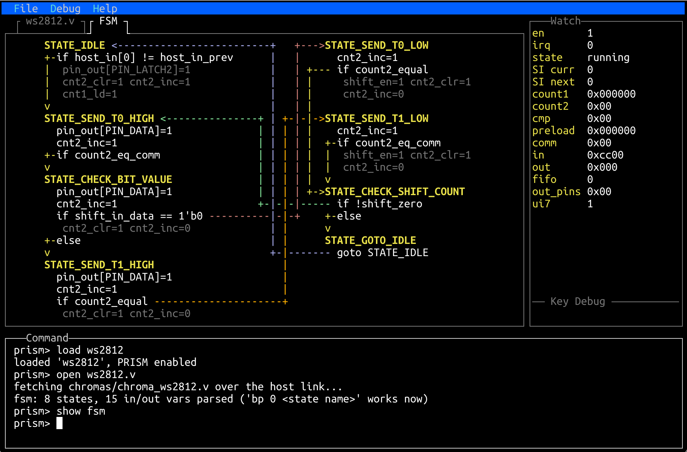

# prism-tui — a terminal workstation for the TinyQV PRISM peripheral

By Ken Pettit, 2026.

Open permissive license ... use freely. No warranties provided :)

`prism-tui` is the firmware and host tooling for **PRISM** — the
*Programmable Reconfigurable Indexed State Machine*, user peripheral **8**
on the Tiny Tapeout **TT Sky 25a** "Asteroids" tapeout. PRISM is a 16‑state
programmable Mealy FSM whose *personality* ("chroma") is loaded at runtime,
so one piece of silicon becomes a WS2812 LED driver, a rotary‑encoder
decoder, an SPI slave, a delta‑sigma streamer, or an **8‑bit PWM audio DAC**
— just by shifting in a different state table.

[](PRISM-TUI.png)

On top of that, this firmware runs a full‑screen terminal UI **on the chip
itself**, over the UART, with:

- **ADPCM audio playback** — the PCM chroma is a 250 kHz PWM DAC; the CPU
  streams IMA‑ADPCM from flash or RAM. A `play -w` mode draws the waveform
  live in braille.
- **Sound packs** — browse and trigger dozens of one‑shot samples.
- **An 80s synthesizer** and a **3‑voice polyphonic PWL synth** with ADSR,
  pitch/vibrato envelopes, a drum kit, and a MIDI‑file player.
- **Chroma tools** — open a chroma's Verilog, view its parsed **FSM state
  diagram**, single‑step the hardware FSM, and read/write its registers.
- A host **filesystem** so listings, songs, sound packs and preferences
  live on your PC and are served to the chip over the console link.

The console tool, `tqv.py`, has **no dependencies** — pure Python standard
library talking straight to the board's USB serial port.

---

## 1. What you need

**Hardware**

- A [Tiny Tapeout demo board](https://tinytapeout.com) with the **TT Sky 25a**
  chip (the tool selects design **495** by default; use `--design` for other
  tapeouts).
- The **QSPI Flash + RAM PMOD** in the chip's PMOD socket — the firmware runs
  from this flash and uses its PSRAM.
- To hear audio: the **Tiny Tapeout Audio PMOD** on the output PMOD, or your
  own RC filter + amplified speaker on `uo_out[7]`. The output is PWM — any
  low‑pass filter into a powered speaker works.
- A USB cable to the demo board.

**Software**

- **Python 3.8+**. `tqv.py` needs only the standard library.
- macOS or Linux work out of the box. Windows needs WSL.
- To *build the firmware* from source: the `riscv32-unknown-elf` GCC
  toolchain (default `/opt/tinyQV`) — see [section 6](#6-building-from-source).
  You do **not** need it just to flash the prebuilt image.
- To *build sound packs* (`mp3todcm/`): `numpy`, `scipy`, and `ffmpeg` on
  your PATH for decoding.

---

## 2. Quick start — flash it and hear something

From the repo root:

```sh
# Program the prebuilt firmware into the board's QSPI flash and attach
# the console.  --baud 1000000 moves the link to 1 Mbaud after boot.
./tqv.py flash prebuilt/prism_tui.bin --baud 1000000
```

You'll land at the `prism>` prompt. To hear something right away (with the
Audio PMOD or a speaker on `uo_out[7]`), type:

```
synthp demo 2   # a polyphonic PWL synth demo — press any key to stop
```

Then explore:

```
help            # list every command
tui             # enter the full-screen terminal UI
```

In the TUI, `CTRL-W` focuses a tab, arrow keys navigate, and `exit` returns
to the plain prompt. `tqv.py` serves the `tqvfs/` directory to the chip, so
`ls`, `cat`, and the `open` command see the files on your PC.

To detach and leave the design running, press **Ctrl‑]**. To re‑attach later
without resetting the board:

```sh
./tqv.py console --baud 1000000
```

---

## 3. Playing the example songs

`examples/` holds three ready‑made IMA‑ADPCM song blobs:

| file | what it is |
|------|------------|
| `examples/spacelove.bin` | "Space Love" — full‑length ADPCM track |
| `examples/zz_sharp.bin`  | "Sharp Dressed Man" ADPCM clip |
| `examples/gmlast.bin`    | a General‑MIDI rendered clip |

Load one straight into the board's PSRAM and play it (this restarts the
design and re‑attaches the console):

```sh
./tqv.py load examples/spacelove.bin --baud 1000000
```

then at the prompt:

```
play spacelove            # or press TAB after 'play ' to list loaded songs
play -w spacelove         # same, with a live braille waveform
```

Press any key to stop; `resume` continues from where you stopped.

**Make it permanent.** `load --flash` writes the song into the board's flash
allocation table (a "FAT") so it survives power cycles and needs no host:

```sh
./tqv.py load examples/zz_sharp.bin --flash --name zz_sharp
./tqv.py fat --flash            # list what's stored in flash
```

After that, `play zz_sharp` works on any boot. `play` with no name lists
every song in the RAM and flash tables.

Already at a `prism>` prompt and don't want to restart? Use `send` to stream
a blob into RAM live:

```sh
./tqv.py send examples/gmlast.bin
```

---

## 4. Sound packs

A **sound pack** (`.spk`) bundles many short samples into one indexed file
the firmware can browse and trigger. `SoundPack1/` contains 41 stock effects
(boings, horns, footsteps, …) as source `.mp3`s.

**Build a pack** with the packer in `mp3todcm/` (needs `numpy`, `scipy`,
`ffmpeg`):

```sh
./mp3todcm/mk_soundpack.py SoundPack1 -o tqvfs/sounds/pack1.spk
```

Every file is decoded, peak‑normalized, resampled to the PCM chroma's rate
and IMA‑ADPCM encoded. Entry names come from the file names (the trailing
stock‑library numbers are dropped): `boing-boing-bounce-454474.mp3` →
`"boing boing bounce"`.

A prebuilt `tqvfs/sounds/pack1.spk` is already included, so you can skip
straight to playing it. Because `tqv.py` serves `tqvfs/`, open the pack in
the TUI over the host link:

```
tui
open pack1.spk            # reads tqvfs/sounds/, TAB completes the name
```

Then `UP`/`DOWN` to pick a sample and `SPACE` (or `p`) to fire it. Add `-w`
(`open pack1.spk -w`) to draw each hit as a scope trace in the command
window (needs the 85 MHz clock).

**Put a pack in flash** (no host needed at play time) by loading it into the
flash table like a song:

```sh
./tqv.py load tqvfs/sounds/pack1.spk --flash --name pack1
```

then `open flash pack1` inside the TUI.

**Make your own pack:** drop any `.mp3` / `.m4a` / `.wav` files into a
directory and point `mk_soundpack.py` at it. See `mp3todcm/README.md` and the
`mp3_to_dsm.py` options (`--trim`, `--autoboost`, …) for converting single
tracks to the `.bin` song format used in [section 3](#3-playing-the-example-songs).

---

## 5. Exploring a chroma's FSM (`show fsm`)

Every chroma is a small state machine, and the TUI can draw it. Because the
picture is built from the chroma's Verilog **and** tied to the running
design, two things must be true first:

1. **The chroma is loaded** (and enabled) on the hardware, and
2. **its `.v` source is open** in a tab (opening it parses the FSM).

```
load ws2812        # load the chroma onto PRISM …
en                 #   … and enable it
tui                # enter the full-screen UI
open ws2812.v      # fetch + parse the Verilog (served from tqvfs/chromas/)
show fsm           # draw the state diagram
```

If you `show fsm` with the `.v` open but a *different* (or no) chroma loaded,
it says so — the diagram always reflects the chroma that is actually running,
so its "current state" arrow and single-step views stay truthful.

**What you get.** Each state shows its name (bright), the outputs it drives
at steady state, and its transitions as `if <cond>` / `else` lines with the
outputs asserted during each. Connections to the target states are drawn as
colored routing lines — one color per destination — through a channel down
the middle, with `->`/`<-` arrowheads landing on the target state.

**Where it draws.** On a terminal wider than 80 columns, `show fsm` splits
the `.v` tab — code on the left, diagram on the right — and repeating the
command toggles it off. On a narrower terminal it opens a dedicated **FSM**
tab instead. Force a tab regardless of width with `show fsm tab`, and take
the diagram down with `hide fsm`. `CTRL-F` / `CTRL-B` scroll the code without
disturbing the split-pane diagram.

On a short terminal the layout compacts automatically: instead of four equal
cells per column, each state takes only the height it needs (with a blank
separator between states) so more of the machine stays on screen.

**Related.** `show <state>` centers that state's code in the `.v` tab;
`print <signal>` reads a parsed input/output pin's live value from the PRISM
registers; and while halted (`halt` / `step` / `go`) the diagram and code
track the hardware's current state. All of these need the parsed `.v`, so
`open <chroma>.v` first.

---

## 6. Building from source

The TinyQV SDK is a git **submodule**. Clone with it, or initialise it after:

```sh
git clone --recursive git@github.com:kdp1965/prism-tui.git
# or, in an existing checkout:
git submodule update --init tinyQV-sdk
```

Build (the Makefile builds the SDK submodule on demand):

```sh
make                       # -> prism_tui.bin  (also .hex, and re-stages chromas)
```

The default toolchain is `/opt/tinyQV`; override with
`make RISCV_TOOLCHAIN=/path/to/riscv32-unknown-elf`. Flash your own build the
same way as the prebuilt:

```sh
./tqv.py flash prism_tui.bin --baud 1000000
```

**Layout**

| path | what |
|------|------|
| `main.c`, `console.c`, `play.c`, `synth*.c`, `midi.c`, … | firmware |
| `tui/` | the on‑chip terminal UI (pdcurses + termcurses over the UART) |
| `chroma_*.c` | compiled chroma bitstreams; `.v`/`.lst` are *served*, not linked |
| `runtime.c` | local ttsky25a runtime (host‑fs syscall glue) |
| `tqv.py`, `run_tinyqv.py` | host console / flashing tool |
| `tqvfs/` | filesystem served to the chip (chromas, songs, sounds, prefs) |
| `tools/` | host helpers (the `l4z` DSM compressor, MIDI converters) |
| `mp3todcm/` | audio → ADPCM converter and sound‑pack builder |
| `examples/`, `prebuilt/`, `SoundPack1/` | ready‑made bins and pack sources |
| `tinyQV-sdk/` | the TinyQV SDK (submodule) |

Chroma `.v` and `.lst` files served in `tqvfs/chromas/` come from a separate
`tinyqv-prism-lite` checkout (a sibling directory); `make chromas` re‑stages
them if you have it, and is a harmless no‑op if you don't.

---

## 7. Handy `tqv.py` commands

| command | does |
|---------|------|
| `flash <bin>` | program firmware into QSPI flash and run it |
| `run` | run whatever is already in flash |
| `console` | attach to a running design without resetting it |
| `load <song.bin>` | load a song blob into PSRAM (`--flash` for the flash FAT) |
| `send <song.bin>` | stream a blob into RAM at the `prism>` prompt |
| `fat [--ram\|--flash]` | list / manage the song & pack tables |
| `reset` | stop the design, hand the board back to its REPL |

Most accept `--baud <rate>` (move the link faster after boot) and `--freq
<MHz>` (project clock). In the console, **Ctrl‑]** detaches and leaves the
design running.
